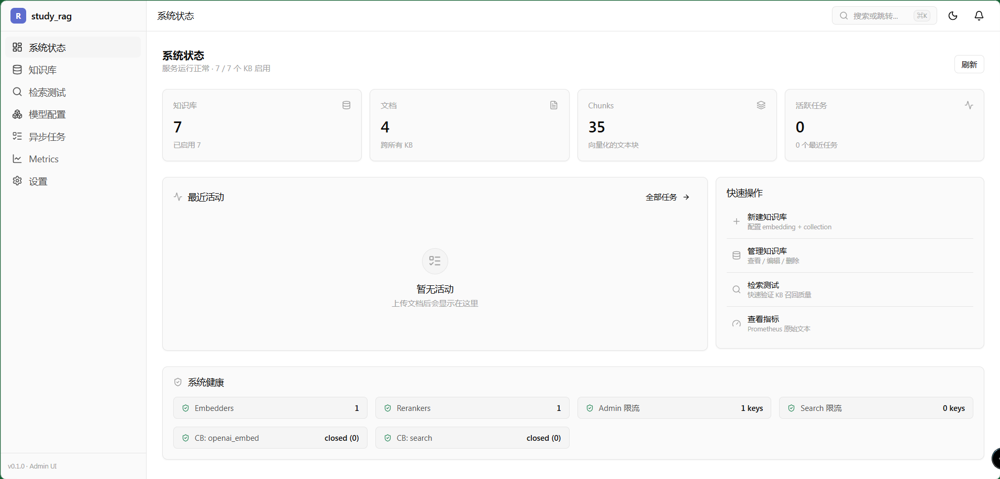
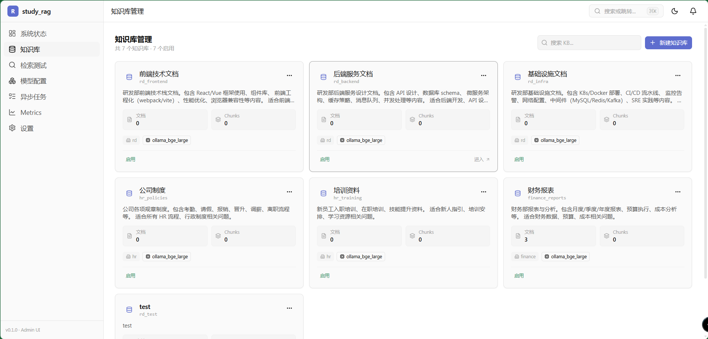
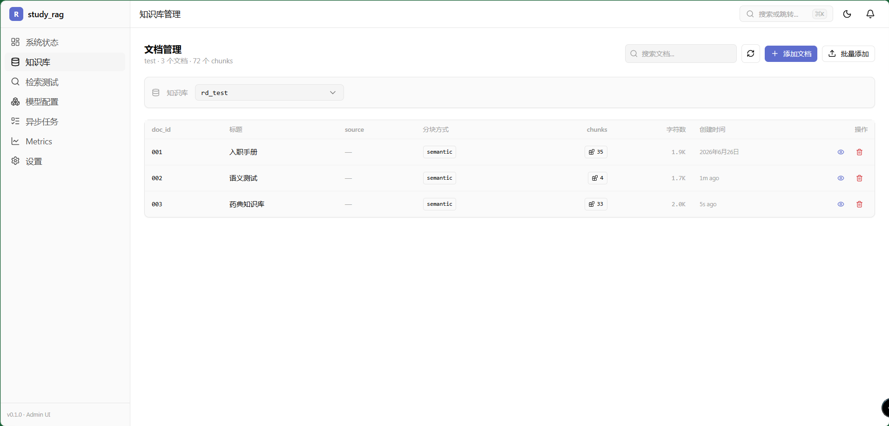
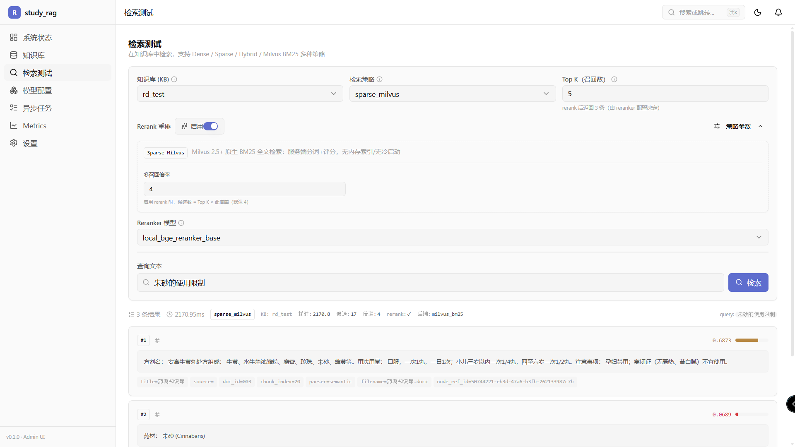
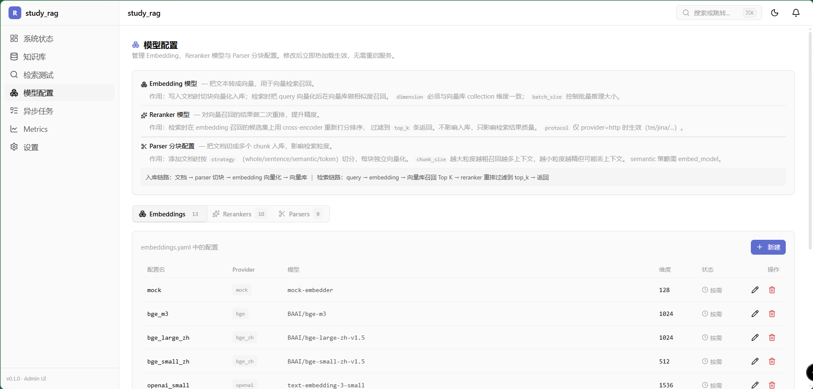
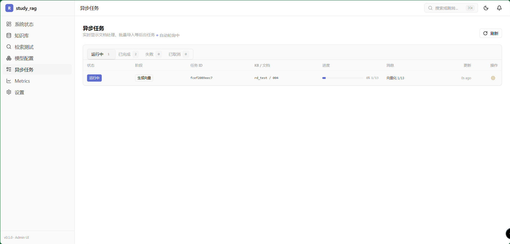

# study_rag

> 基于 LlamaIndex 的企业知识库检索服务，通过 MCP 协议暴露给 Agent 调用。
>
> Enterprise knowledge base retrieval service built on LlamaIndex, exposed to AI agents via MCP.

[](LICENSE)
[](https://www.python.org/)
[](https://fastapi.tiangolo.com/)
[](https://modelcontextprotocol.io/)
[](https://milvus.io/)
[](https://react.dev/)

## 项目简介

study_rag 是一个可插拔、多租户的企业级 RAG（检索增强生成）知识库服务。它把「知识库管理 + 文档处理 + 多策略检索」打包成一组能力，既提供 **MCP Tool** 供 AI Agent 直接调用，也提供 **Admin REST + Web 控制台** 供人工管理。

核心价值：
- **Agent 即用**：符合 MCP 规范，Claude / Cursor / 任意 MCP 客户端接上即可检索你的知识库
- **多策略检索**：Dense / Sparse / Hybrid / Milvus 原生 BM25 / Hybrid-Milvus 五种策略可按请求切换
- **能力可插拔**：Embedding / VectorStore / Reranker / Parser 均为接口化设计，配置即切换
- **生产就绪**：structlog 结构化日志、Prometheus 指标、限流、熔断、Docker Compose 一键部署

## 技术栈

| 层 | 技术 |
|---|---|
| 后端 | Python 3.10+、FastAPI、Pydantic、structlog |
| 检索框架 | LlamaIndex（NodeParser 切块）、自研 RetrievalEngine 抽象 |
| 向量库 | Milvus 2.5+（原生 BM25）、可扩展 Qdrant / InMemory |
| Embedding | OpenAI / Ollama / BGE，接口化可替换 |
| Reranker | BGE / Cohere / TEI，接口化可替换 |
| MCP | FastMCP、Streamable HTTP transport |
| 前端 | React + Vite + TypeScript + shadcn/ui |
| 可观测 | Prometheus 指标、structlog 日志、限流、熔断 |
| 部署 | Docker Compose（admin + mcp 双进程）、tini、非 root |
| 工程化 | ruff（lint）、pytest、justfile、TypeScript typecheck |

## 运行截图

> 截图存放于 `docs/images/` 目录，启动 admin 服务（`http://localhost:3200/admin/ui/`）后截图即可。

<table>
  <tr>
    <td width="50%" align="center"><b>仪表盘 Dashboard</b></td>
    <td width="50%" align="center"><b>知识库管理</b></td>
  </tr>
  <tr>
    <td></td>
    <td></td>
  </tr>
  <tr>
    <td width="50%" align="center"><b>文档管理</b></td>
    <td width="50%" align="center"><b>检索测试</b></td>
  </tr>
  <tr>
    <td></td>
    <td></td>
  </tr>
  <tr>
    <td width="50%" align="center"><b>模型配置</b></td>
    <td width="50%" align="center"><b>异步任务</b></td>
  </tr>
  <tr>
    <td></td>
    <td></td>
  </tr>
</table>

## 特性

- **多知识库管理**：支持按部门/主题配置多个知识库
- **多租户隔离**：基于 api_key 的用户 ↔ 知识库权限矩阵
- **MCP 协议（Streamable HTTP）**：10 个核心 Tool，提供发现/检索/文档管理完整能力
- **能力可插拔**：Embedding / VectorStore / Reranker 均可替换实现
- **LlamaIndex 整合**：NodeParser 切块、双检索路径（自研 + LlamaIndex）
- **文档管理增强**：支持文本输入 / 文件上传（txt / md / html / pdf / docx），
  多种切块策略（whole / sentence / token / semantic 通过命名 parser），
  分块预览（提交前看到每块内容/大小），策略通过 `configs/llamaindex.yaml` 配置
- **分块查看**：管理 UI「文档」列表的「查看分块」按钮 → Drawer 显示该文档
  所有 chunk 的 `#索引 / 字符数 / 完整文本 / 源 metadata`，分页 20/页
  （对应 `GET /admin/kbs/{kb_id}/documents/{doc_id}/chunks` 端点）
- **Parser Registry**：命名 parser 实体，类似 embedder / reranker 的注册表设计，
  提供 `get_parser(name)` / `list_parsers()` 接口
- **新 API 端点**：`GET /admin/parsers` / `POST /documents/preview-chunk` /
  `POST /documents/upload`
- **统一管理面**：FastAPI 提供知识库 CRUD + 健康检查

## 文档

| 文档 | 内容 |
|---|---|
| [部署指南](docs/deployment.md) | Docker Compose、镜像构建、Milvus、生产清单、运维操作 |
| [配置参考](docs/configuration.md) | 所有 YAML 配置文件、环境变量、provider 对照表 |
| [本文档](#mcp-tool-完整列表) | MCP Tool 完整 API、客户端示例、错误码 |

## 快速开始

### Docker Compose（推荐）

```bash
# 1. 准备环境变量
cp .env.example .env
#   按需编辑 .env（至少配置一个 embedding 后端的 API_KEY）

# 2. 构建并启动 admin + mcp
docker compose -f docker/docker-compose.yml up -d --build
#   或: just docker-up

# 3. 带 Milvus 向量库一体化启动
docker compose -f docker/docker-compose.yml --profile vector up -d --build
#   或: just docker-up-vector

# 端点：
#   管理 UI      http://localhost:3200/admin/ui/
#   OpenAPI 文档  http://localhost:3200/docs
#   MCP 端点      http://localhost:3220/mcp
#   健康检查      http://localhost:3200/health  /  http://localhost:3220/health
```

详见 [部署指南](docs/deployment.md)。

### 本地 Python

```bash
# 安装依赖
pip install -e ".[dev,llamaindex,vector-milvus,embedding-bge,reranker-bge]"

# 启动 admin REST（port 3200）
study-rag

# 启动 MCP standalone server（port 3220，streamable_http transport）
study-rag-mcp

# MCP 端点
http://localhost:3220/mcp

# Admin REST 端点
http://localhost:3200/admin/docs
```

### 本地开发

```powershell
# 一键脚本（PowerShell）
pwsh scripts/dev.ps1 mcp        # 启 MCP server
pwsh scripts/dev.ps1 inspector  # 启 MCP Inspector（浏览器调试）
pwsh scripts/dev.ps1 admin      # 启 admin REST
pwsh scripts/dev.ps1 all-verify # 跑 lint + typecheck + 全 verify
```

## 架构

```
study_rag/
├── capabilities/        # 能力层（embedding/vector_store/reranker/llamaindex/retrieval）
├── knowledge_bases/     # 知识库管理（registry/manager/models/config_store）
├── auth/                # 鉴权（占位实现，含 writable_kbs）
├── mcp/                 # MCP 服务（10 个 Tool + 3 Resource + 2 Prompt + filter）
├── api/                 # FastAPI 管理面（admin/health）
├── jobs/                # 异步任务（文档切块流水线）
├── observability/       # 日志(structlog)/指标(Prometheus)/限流/熔断/中间件
├── web/                 # Admin UI SPA 构建产物挂载（/admin/ui/）
├── mcp_standalone.py    # MCP 独立部署入口（streamable_http）
├── app.py               # Admin REST 入口
├── settings.py          # 全局配置（pydantic-settings）
├── frontend/            # React + Vite + shadcn/ui 管理控制台源码
├── configs/             # YAML 配置（支持 ${ENV_VAR} 占位符）
│   ├── knowledge_bases.yaml
│   ├── embeddings.yaml
│   ├── vector_store.yaml
│   ├── reranker.yaml
│   ├── retrieval.yaml
│   ├── llamaindex.yaml
│   └── llm.yaml
├── docker/              # 容器化（Dockerfile + docker-compose + entrypoint）
├── docs/                # 文档（deployment.md / configuration.md）
└── scripts/             # 开发脚本（dev.ps1 / inspector.ps1）
```

**部署拓扑**（两进程独立扩缩容）：

```
  Agent / LLM ──MCP──▶  mcp:3220  ──▶  ┌─ embeddings (OpenAI/BGE/Ollama)
                                       ├─ rerankers  (BGE/Cohere/TEI)
  浏览器 ──HTTP──▶  admin:3200 ──▶     └─ vector_store (Milvus/Qdrant/mock)
    └─ /admin/ui/  (React SPA)
    └─ /admin/*    (KB/文档 CRUD)
    └─ /metrics    (Prometheus)
```

详见 [配置参考](docs/configuration.md)。

## 环境变量

核心变量（完整列表见 [`.env.example`](.env.example) 和 [配置参考](docs/configuration.md#环境变量参考)）：

| 变量 | 默认 | 说明 |
|---|---|---|
| `STUDY_RAG_PORT` | `3200` | admin REST 端口 |
| `MCP_PORT` | `3220` | MCP 端口 |
| `STUDY_RAG_LOG_LEVEL` | `INFO` | 日志级别 |
| `STUDY_RAG_ADMIN_TOKEN` | *(空)* | admin Bearer Token（生产必设） |
| `STUDY_RAG_MCP_REQUIRE_API_KEY` | `false` | 强制 MCP api_key |
| `MILVUS_URI` | `http://milvus:19530` | 向量库地址 |
| `OPENAI_API_KEY` | *(空)* | OpenAI embedding key |

YAML 配置内的 `${VAR}` 占位符在运行时解析为环境变量，无需改代码即可切换后端。

---

# MCP Tool 完整列表

study_rag 在 Streamable HTTP transport 下暴露 **10 个核心 Tool**。
所有 Tool 都接受 `api_key: str` 作为第一个参数（当前为占位鉴权）。

返回值为 JSON 字符串（避免 FastMCP 对 list[dict] 的副作用），客户端用 `json.loads(text)` 解析。

## 1. `list_accessible_kbs` — 发现可用知识库

**任何检索操作的第一步**。先调用本 Tool 了解有哪些 KB 可用、每个 KB 的描述。

| 参数 | 类型 | 必填 | 说明 |
|---|---|---|---|
| `api_key` | str | ✓ | 用户凭证 |

返回：`list[KBInfo]`，每个元素包含：

```json
[
  {
    "kb_id": "rd_frontend",
    "name": "前端研发文档",
    "description": "React / Vue 组件库、状态管理、性能优化",
    "department": "rd",
    "enabled": true,
    "document_count": 42
  }
]
```

异常：
- 鉴权失败 → `permission_denied`

适用场景：
- 任何检索前必调
- 不确定有哪些 KB
- 需要根据 description 判断查询相关 KB

---

## 2. `get_kb_info` — 获取知识库详情

确认 KB 的 embedding / reranker / 文档数等细节，决定是否检索它。

| 参数 | 类型 | 必填 | 说明 |
|---|---|---|---|
| `api_key` | str | ✓ | |
| `kb_id` | str | ✓ | 知识库 ID（命名规范 `{dept}_{name}`） |

返回：

```json
{
  "kb_id": "rd_frontend",
  "name": "前端研发文档",
  "description": "...",
  "department": "rd",
  "enabled": true,
  "document_count": 42,
  "embedding": "bge-large-zh",
  "reranker": "bge-reranker-large",
  "extra": {}
}
```

异常：
- KB 不存在 / 用户无权 → `kb_not_found`

---

## 3. `search_kb` — 单知识库检索（核心）

在指定 KB 中检索 top-k 相关文档。可选启用 rerank、metadata filter。

| 参数 | 类型 | 必填 | 默认 | 说明 |
|---|---|---|---|---|
| `api_key` | str | ✓ | | |
| `kb_id` | str | ✓ | | 知识库 ID |
| `query` | str | ✓ | | 检索问题 |
| `top_k` | int | | 5 | 返回数量，范围 (0, 50] |
| `use_rerank` | bool | | true | 是否启用重排 |
| `filter_expr` | dict | | null | metadata 过滤条件 |

**filter_expr 操作符后缀：**

| 后缀 | 含义 | 示例 |
|---|---|---|
| 无 / `__eq` | 等于 | `{"source": "wiki"}` |
| `__ne` | 不等于 | `{"status__ne": "draft"}` |
| `__in` | 在列表中 | `{"tag__in": ["api", "db"]}` |
| `__nin` | 不在列表中 | `{"tag__nin": ["internal"]}` |
| `__gt` / `__gte` | 大于 / ≥ | `{"year__gte": 2024}` |
| `__lt` / `__lte` | 小于 / ≤ | `{"score__lt": 0.5}` |
| `__contains` | 字符串包含 | `{"title__contains": "API"}` |
| `__exists` | 字段是否存在 | `{"draft__exists": false}` |

**多条件用 AND 连接**：`{"year__gte": 2024, "tag__in": ["api"]}` 表示 `year >= 2024 AND tag in [api]`。

返回：

```json
[
  {
    "doc_id": "doc-123",
    "title": "React 18 并发渲染机制",
    "text": "React 18 引入了并发渲染...",
    "score": 0.87,
    "metadata": {
      "source": "wiki",
      "year": 2024,
      "tag": "frontend"
    }
  }
]
```

异常：
- KB 不存在 / 无权 → `kb_not_found`
- `query` 为空 / `top_k` 超范围 → `invalid_parameter`
- `filter_expr` 字段名非法 → `invalid_parameter`

---

## 4. `search_all_accessible_kbs` — 跨知识库综合检索

不确定查哪个 KB 时的兜底入口。在所有可访问 KB 中并行检索，按相关度合并排序。

| 参数 | 类型 | 必填 | 默认 | 说明 |
|---|---|---|---|---|
| `api_key` | str | ✓ | | |
| `query` | str | ✓ | | |
| `top_k` | int | | 5 | 最终返回条数 |
| `use_rerank` | bool | | true | |
| `filter_expr` | dict | | null | 下推到每个 KB |

返回：与 `search_kb` 一致，但每条 hit 的 `metadata._source_kb` 标识来源 KB ID。

实现细节：每个 KB 内部用各自 reranker 重排，跨 KB 层仅按分数合并（不同 KB 的 reranker 分数量纲不同，硬合并不严谨）。

---

## 5. `get_document` — 获取文档完整内容

`search_kb` 返回的是文档片段，看全文用本 Tool。

| 参数 | 类型 | 必填 | 说明 |
|---|---|---|---|
| `api_key` | str | ✓ | |
| `kb_id` | str | ✓ | |
| `doc_id` | str | ✓ | 文档 ID |

返回：文档元数据 + 完整 `content`。

异常：
- 文档不存在 → `document_not_found`

---

## 6. `list_documents` — 列出 KB 中的文档

| 参数 | 类型 | 必填 | 默认 | 说明 |
|---|---|---|---|---|
| `api_key` | str | ✓ | | |
| `kb_id` | str | ✓ | | |
| `limit` | int | | 100 | 返回条数上限，范围 (0, 1000] |
| `offset` | int | | 0 | 跳过条数（分页） |

返回：`list[DocumentSummary]`，按创建时间倒序。

---

## 7. `add_document` — 添加文档（整篇一个 chunk）

需要写权限（`writable_kbs` 包含 `kb_id`）。

| 参数 | 类型 | 必填 | 默认 | 说明 |
|---|---|---|---|---|
| `api_key` | str | ✓ | | |
| `kb_id` | str | ✓ | | |
| `doc_id` | str | ✓ | | KB 内唯一 |
| `title` | str | ✓ | | |
| `content` | str | ✓ | | |
| `source` | str | | null | 来源；自动存为 `metadata['source']` |
| `metadata` | dict | | null | 额外 metadata |
| `overwrite` | bool | | false | 已存在时是否覆盖 |

`source` / `metadata` 字段可在后续 `search_kb` 的 `filter_expr` 中引用。

异常：
- 无写权限 → `permission_denied`
- doc_id 已存在 + `overwrite=False` → `document_already_exists`
- 参数非法 → `invalid_parameter`

---

## 8. `add_document_chunked` — 添加文档（NodeParser 切块）

需要写权限。整篇文档会按 LlamaIndex NodeParser 切块后入库。

| 参数 | 类型 | 必填 | 默认 | 说明 |
|---|---|---|---|---|
| `api_key` | str | ✓ | | |
| `kb_id` | str | ✓ | | |
| `doc_id` | str | ✓ | | |
| `title` | str | ✓ | | |
| `content` | str | ✓ | | |
| `source` | str | | null | |
| `metadata` | dict | | null | |
| `parser_config` | dict | | null | NodeParser 配置 |
| `overwrite` | bool | | false | |

`parser_config` 示例：
```json
{
  "strategy": "sentence",
  "chunk_size": 512,
  "chunk_overlap": 50
}
```

适用场景：长文档（> 1000 字）建议用本接口。

---

## 9. `add_documents_batch` — 批量添加文档

需要写权限。失败的单条不影响其他（通过日志记录）。

| 参数 | 类型 | 必填 | 默认 | 说明 |
|---|---|---|---|---|
| `api_key` | str | ✓ | | |
| `kb_id` | str | ✓ | | |
| `documents` | list[dict] | ✓ | | 每项：`{"doc_id", "title", "content", "source"?, "metadata"?}` |
| `overwrite` | bool | | false | |

上限 500 条/次。

---

## 10. `delete_document` — 删除文档

需要写权限。向量 + meta 一起删。

| 参数 | 类型 | 必填 | 说明 |
|---|---|---|---|
| `api_key` | str | ✓ | |
| `kb_id` | str | ✓ | |
| `doc_id` | str | ✓ | |

异常：
- 无写权限 → `permission_denied`
- 文档不存在 → `document_not_found`

---

## 典型工作流

```text
1. list_accessible_kbs(api_key)                    # 了解有哪些 KB
2. (可选) get_kb_info(api_key, kb_id)              # 确认 KB 范围
3. search_kb(api_key, kb_id, query, top_k=5)       # 检索
4. (可选) get_document(api_key, kb_id, doc_id)     # 拿完整文档
```

兜底：`search_all_accessible_kbs(api_key, query)` 跨 KB 检索。

---

## 客户端示例

### Python（用官方 mcp SDK）

```python
import asyncio
import json
from mcp import ClientSession
from mcp.client.streamable_http import streamablehttp_client

async def main():
    async with streamablehttp_client("http://localhost:3220/mcp") as (
        read_stream,
        write_stream,
        _get_session_id,
    ):
        async with ClientSession(read_stream, write_stream) as session:
            await session.initialize()
            # 列工具
            tools = await session.list_tools()
            # 检索
            result = await session.call_tool(
                "search_kb_tool",
                arguments={
                    "api_key": "test",
                    "kb_id": "rd_frontend",
                    "query": "React 18 怎么用并发渲染？",
                    "top_k": 5,
                },
            )
            # content[0].text 是 JSON 字符串
            hits = json.loads(result.content[0].text)
            for h in hits:
                print(f"[{h['score']:.2f}] {h['title']}")

asyncio.run(main())
```

### TypeScript

```typescript
import { Client } from "@modelcontextprotocol/sdk/client/index.js";
import { StreamableHTTPClientTransport } from "@modelcontextprotocol/sdk/client/streamableHttp.js";

const client = new Client({ name: "my-agent", version: "1.0.0" });
const transport = new StreamableHTTPClientTransport(
  new URL("http://localhost:3220/mcp")
);
await client.connect(transport);

const result = await client.callTool({
  name: "search_kb_tool",
  arguments: {
    api_key: "test",
    kb_id: "rd_frontend",
    query: "React 18 怎么用并发渲染？",
    top_k: 5,
  },
});
const hits = JSON.parse(result.content[0].text);
```

### Claude Desktop 配置

`~/Library/Application Support/Claude/claude_desktop_config.json`（macOS）或对应平台路径：

```json
{
  "mcpServers": {
    "study-rag": {
      "url": "http://localhost:3220/mcp",
      "transport": "streamable_http"
    }
  }
}
```

---

## 错误码

| code | 含义 | 触发场景 |
|---|---|---|
| `permission_denied` | 鉴权失败 | api_key 无效 / 用户无权访问该 KB |
| `kb_not_found` | KB 不存在 | kb_id 不存在或被禁用 |
| `document_not_found` | 文档不存在 | doc_id 不存在 |
| `document_already_exists` | 文档已存在 | add_document 时 doc_id 重复，且未传 overwrite |
| `invalid_parameter` | 参数非法 | query 为空、top_k 超范围、filter_expr 字段名非法 |

所有错误通过 MCP 标准的 `error.code` 字段返回（JSON-RPC 格式）。

---

## 调试

```powershell
# 启动 MCP server
pwsh scripts/dev.ps1 mcp

# 启动 MCP Inspector（浏览器）
pwsh scripts/dev.ps1 inspector
# 浏览器打开 http://localhost:3210
# 选 transport: streamable_http
# URL: http://localhost:3220/mcp
# Connect → List Tools → 选 Tool → 填参数 → Call Tool
```

---

## 协议版本

- MCP protocol: `2025-03-26`
- Transport: Streamable HTTP
- Python: `>=3.10`
- FastMCP: `>=1.0`
